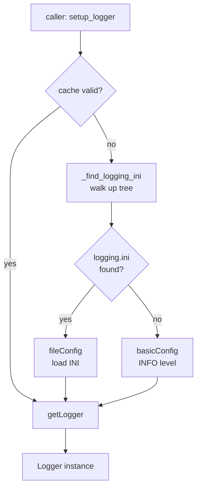

# loggingx v1.0.0

> A Python library that augments the standard `logging` module with simplified, INI-driven configuration.

## Prerequisites

- Python `>=3.14`

## Installation

```bash
pip install loggingx
```

## Usage

Import `setup_logger` directly from the `loggingx` package:

```python
from loggingx import setup_logger

logger = setup_logger(__name__)
logger.info("Hello from loggingx!")
```

`setup_logger` searches upward from the current working directory for a `logging.ini` file and caches the resolved path for subsequent calls. If no configuration file is found, it falls back to `basicConfig` at `INFO` level.

### Optional parameters

| Parameter  | Type         | Default                   | Description                                             |
| ---------- | ------------ | ------------------------- | ------------------------------------------------------- |
| `name`     | `str`        | *(required)*              | Logger name, typically `__name__`.                      |
| `conf_dir` | `str | None` | Current working directory | Directory to begin the upward search for `logging.ini`. |
| `log_ini`  | `str | None` | `"logging.ini"`           | Name of the logging configuration file to locate.       |

## Architecture



## Configuration

Place a `logging.ini` file in your project root. The bundled default configures two handlers:

| Handler | Target         | Format                                                          |
|---------|----------------|-----------------------------------------------------------------|
| Console | `sys.stderr`   | `%(asctime)s - %(name)s - %(levelname)s - %(message)s`          |
| File    | `loggingx.log` | `%(asctime)s [%(levelname)s] %(name)s - %(message)s`            |

Example `logging.ini`:

```ini
[loggers]
keys=root

[handlers]
keys=consoleHandler,fileHandler

[formatters]
keys=logFormatter,consoleFormatter

[logger_root]
level=INFO
handlers=consoleHandler,fileHandler

[handler_consoleHandler]
class=StreamHandler
formatter=consoleFormatter
args=(sys.stderr,)

[handler_fileHandler]
class=FileHandler
formatter=logFormatter
args=('loggingx.log', 'a')

[formatter_logFormatter]
format=%(asctime)s [%(levelname)s] %(name)s - %(message)s

[formatter_consoleFormatter]
format=%(asctime)s - %(name)s - %(levelname)s - %(message)s
```

## Development

> Requires [Poetry](https://python-poetry.org/) `2.2`.

### Setup

```bash
poetry install
```

### Running Tests

```bash
poetry run pytest --cov=loggingx tests --cov-report html
```

### Formatting and Linting

```bash
poetry run black loggingx; poetry run pylint loggingx
```

Pylint must score **10/10**. Minimum test coverage is **80%**.

## [Changelog](CHANGELOG.md)

See [CHANGELOG.md](CHANGELOG.md) for the full version history.

## License

MIT

## Author

Ronaldo Webb &lt;ron@ronella.xyz&gt;
